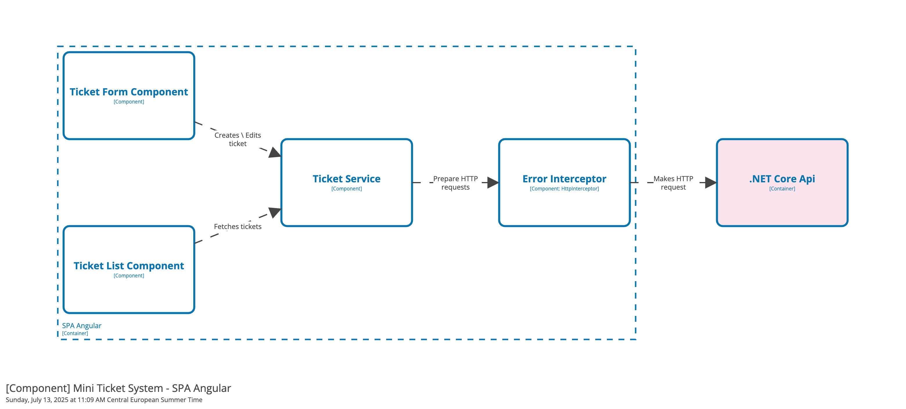

# Mini Ticket System

This is a simple web app for managing tickets. It allows users to create, update, and delete tickets, as well as view ticket details.

## Main Purpose

This repository is a example of a full-stack application using ASP.NET Core for the backend and Angular for the frontend. It demonstrates how to build a RESTful API with Entity Framework Core and how to consume that API with an Angular application.

It is a simple example for recruitment purposes, showcasing the ability to create a full-stack application with modern technologies.

## Technologies Used

- ASP.NET Core 9
- Entity Framework Core
- Angular 20
- Angular Material

## Architecture

